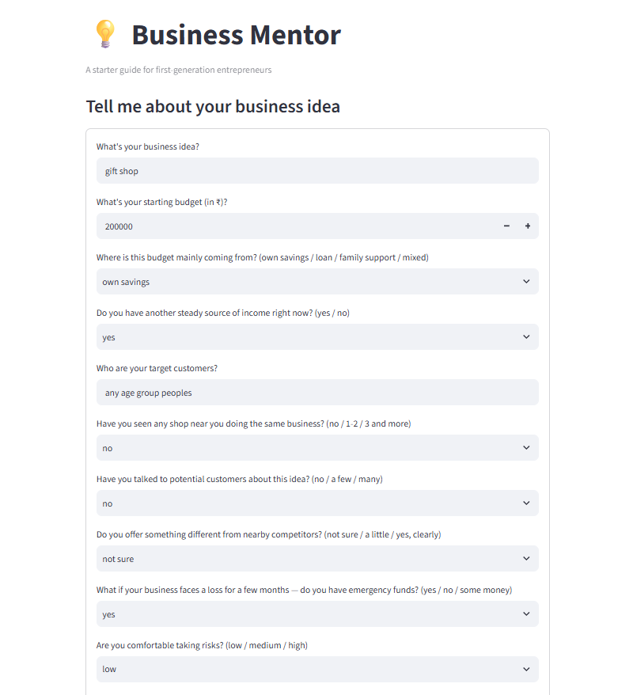
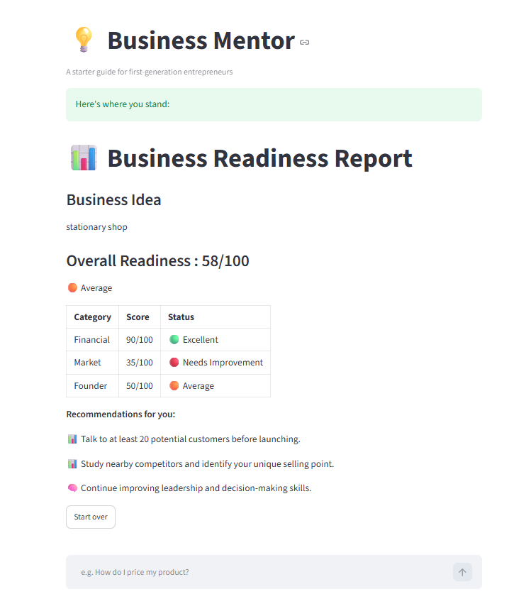
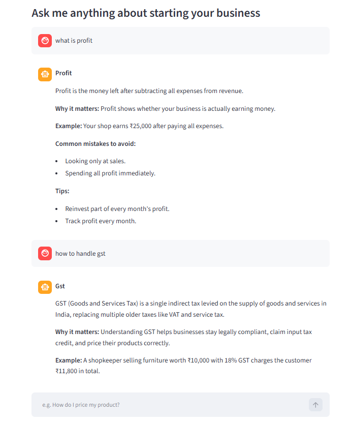
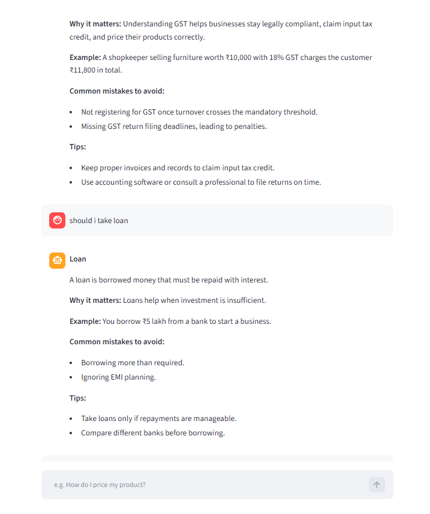
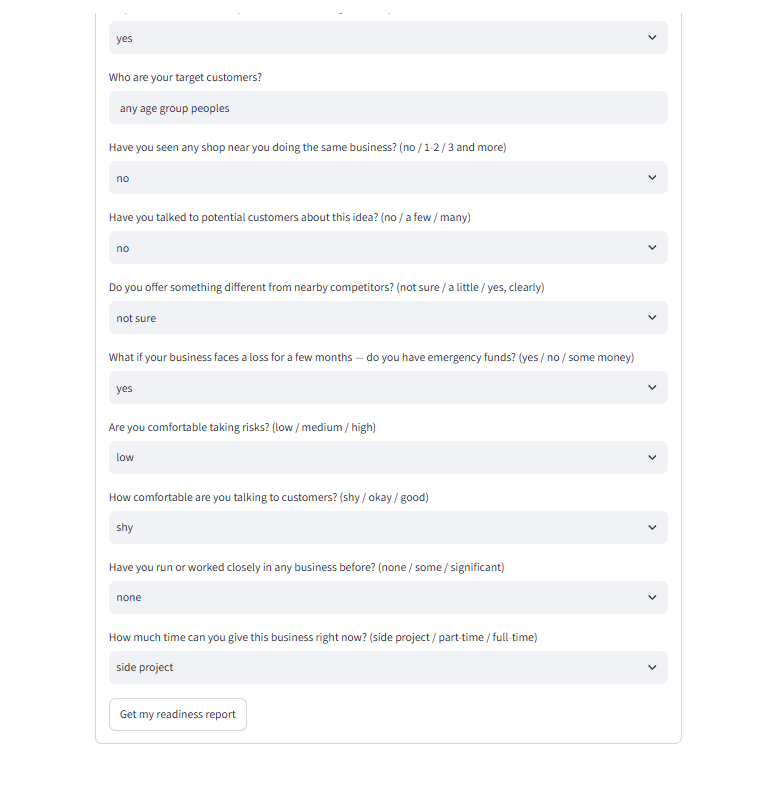

# 📊 AI Business Mentor

An AI-powered Business Mentor built using **Python**, **Streamlit**, and **Google Gemini API**.

The application helps first-time entrepreneurs by:

- Answering business-related questions
- Evaluating business readiness
- Providing personalized recommendations
- Retrieving information from a custom business knowledge base

---

# Features

✅ Business Readiness Scoring

- Financial Readiness
- Market Understanding
- Founder Preparedness
- Overall Readiness Score

---

✅ Knowledge Base

- Business
- Finance
- Marketing
- Sales
- Risk Management
- Operations
- Communication
- Legal
- Growth
- Mindset

---

✅ Smart Question Answering

- Keyword classification
- Knowledge retrieval
- Alias matching
- Typo correction
- AI fallback using Gemini API

---

# Tech Stack

- Python
- Streamlit
- Google Gemini API
- Git
- GitHub

---

# Project Structure

```
business_mentor/
│
├── app.py
├── classifier.py
├── pipeline.py
├── retriever.py
├── response_generator.py
├── scoring.py
├── search_engine.py
├── knowledge/
├── images/
└── README.md
```

---

# Screenshots

## Home Page



---

## Business Readiness Report



---

## Question Answering



---

## Another Example



---

## Home Screen



---

# Future Improvements

- Better typo correction
- More business knowledge
- Better recommendation engine
- Voice input
- Multilingual support 

## Live Demo

https://business-mentor-ai-3kdjffkrlr2uitaant9kpc.streamlit.app/